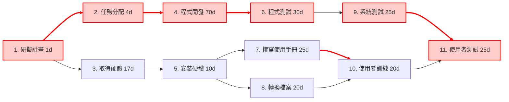

## (1）PERT/CPM圖

---
## (2) 甘特圖
```mermaid
gantt
    title 專案甘特圖 (紅色 = 關鍵路徑，總工期 155 天)
    dateFormat  YYYY-MM-DD
    axisFormat  %m/%d

    section 計畫
    研擬計畫       :crit, a1, 2025-09-01, 1d
    任務分配       :crit, a2, after a1, 4d
    取得硬體       :a3, after a1, 17d

    section 開發
    程式開發       :crit, a4, after a2, 70d
    安裝硬體       :a5, after a3, 10d

    section 測試 & 文件
    程式測試       :crit, a6, after a4, 30d
    撰寫使用手冊   :a7, after a5, 25d
    轉換檔案       :a8, after a5, 20d

    section 系統驗證
    系統測試       :crit, a9, after a6, 25d
    使用者訓練     :a10, after a7, 20d
    使用者訓練     :a10, after a8, 20d
    使用者測試     :crit, a11, after a9, 25d
    使用者測試     :crit, a11, after a10, 25d

